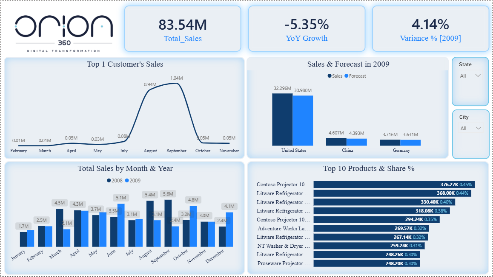

# Orion_Technical_Test

End-to-end data pipeline for the Orion Technical Assessment: raw JSON sales/forecast
data → Python ETL → SQL Server staging/data warehouse (star schema) → Power BI
dashboard.



## Project structure

```
.
├── Notebook/
│   └── etl_pipeline.ipynb        # Extract, clean, transform Sales.json + forecast.json
├── sql/
│   ├── ddl/
│   │   └── 01_create_schema_and_tables.sql   # stg + dw schemas, all tables, FKs
│   └── dml/
│       └── 01_load_stg_to_dw.sql             # BULK INSERT + stg → dw load logic
├── powerbi/
│   └── Orion_Dashboard.pbix      # Final dashboard
├── images/
    └── dashboard_overview.png    # Dashboard screenshot

```

## Source data

| File | Rows | Grain |
|---|---|---|
| `Sales.json` | 298,246 | One row per transaction (product + customer + day) |
| `forecast.json` | 33 | One row per Country × Brand × Year (2009 only) |


## Pipeline overview

**1. ETL (`Notebook.ipynb`)**
Streams the 187MB `Sales.json` with `json`, cleans nulls/types, and splits the flat
source records into a star schema: `Products`, `Customers`, `Sales` (fact),
`Forecast` (fact). Outputs four CSVs.

**2. SQL Server warehouse (`SQL/ddl`, `SQL/dml`)**
Two-schema design:
- **`stg`** — raw, typed, unconstrained mirror of the CSVs (no business logic)
- **`dw`** — star schema with surrogate keys, FKs, and a `Dim_Date` table built
  dynamically from the actual Sales date range

Load order: `Dim_Date → Dim_Products → Dim_Customers → Fact_Sales → Fact_Forecast`.

**3. Power BI dashboard (`powerbi/Orion_Dashboard.pbix`)**
Connects to the `dw` schema. KPI cards, monthly sales trend (2008 vs 2009), top 10
products by share, Sales vs Forecast by Country/Brand, and top customer monthly
trend.

## Key design decisions (the ones that weren't obvious upfront)

These came up during development and materially changed the output — documented in
full in [`docs/assumptions_and_findings.md`](docs/assumptions_and_findings.md):

- **No deduplication on `Fact_Sales`.** ~73% of rows looked like exact duplicates
  (no order ID or timestamp in the source). Tested the impact directly:
  deduplicating erased **~49% of total revenue** ($83.5M → $42.6M). Every row is
  kept as a distinct, valid sale.
- **`Fact_Forecast` has no FK relationship to `Dim_Products` or `Dim_Customers`.**
  Forecast's grain (Country × Brand × Year) doesn't share a unique key with either
  dimension — `Brand`/`CountryRegion` are attributes, not keys. Comparisons are done
  via DAX (`TREATAS`) or visual-level aggregation, not a modeled relationship.
- **Forecast only contains 2009.** Any Forecast-vs-Actual comparison filters Sales
  to 2009 as well, or the comparison is meaningless.
- **A small `Dim_Year` bridge table** relates `Fact_Forecast[Year]` into the model
  without forcing a many-to-many relationship (which was tried and caused incorrect
  fan-out — see findings doc).

## How to reproduce

1. Run `etl/etl_pipeline.ipynb` top to bottom against `Sales.json` / `forecast.json`
   → produces `Products.csv`, `Customers.csv`, `Sales.csv`, `Forecast.csv`.
2. Run `sql/ddl/01_create_schema_and_tables.sql` against a new SQL Server database.
3. Update the file paths in `sql/dml/01_load_stg_to_dw.sql` to point at your CSVs,
   then run it.
4. Open `powerbi/Orion_Dashboard.pbix`, point the data source at your SQL Server
   instance, refresh.

## Tech stack

Python (pandas, ijson) · SQL Server (T-SQL) · Power BI (DAX)
